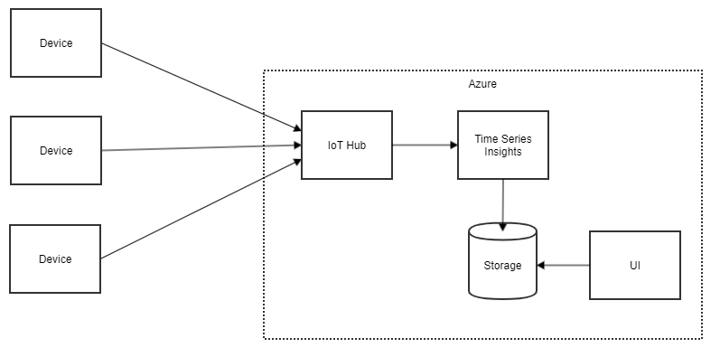

# Architecture overview

The solution is built around Azure IoT hub. Devices connect to the hub and data is the processed by Time Series Insights and persisted in a blob storage. This data can be then viewed and queried either via TSI explorer or Power BI report or a generic web application.

## Implemented solution

Only the part where devices send data to IoT hub was implemented. The number of received messages can be viewed on IoT bub's overview page in Azure portal.

# Work assessment

Priority | Task | Estimate [md] | Comment
-------- | ---- | -------- | -------
1 | Create Azure resources for testing | 1 | To unblock developers of the device software
2 | Code and test device software | 5 |
2 | Configure CI/CD pipeline to deploy to DEV environment | 5 |
3 | Prepare certificates for devices | 2 |
3 | Implement full CI/CD pipeline | 5 |
4 | Integration tests | 10 |
4 | Performance tests | 10 |

## Missing pieces

### How to secure the devices?
A self signed certificate perhaps. How will it be delivered to the device? What if it needs to be rotated?

### How do we present the data?
Is TSI explorer enough? What is the actual requirement here?

### Is TSI fit for the purpose?
TSI may be too heavyweight for this scenario. What kind of processing do we need? What if we move beyond counting messages?